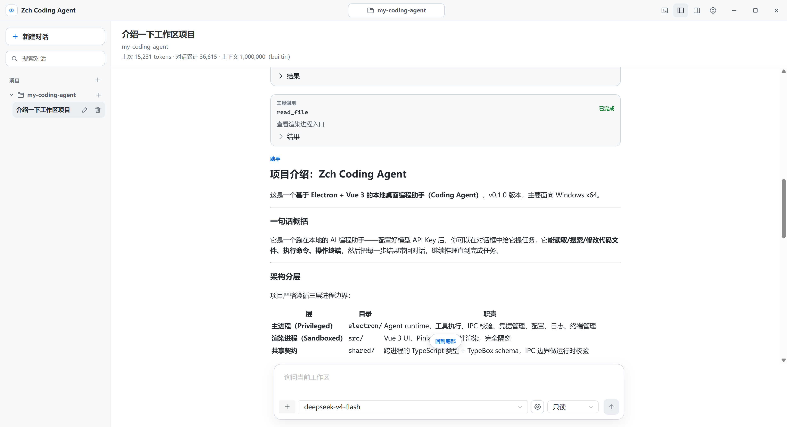

# Zch Coding Agent

安装：普通用户可以直接在 GitHub Releases 下载 `Zch Coding Agent-Windows-*-Setup.exe` 安装包并运行安装；当前发布目标是 Windows x64。开发者需要 Node.js 24，克隆仓库后执行 `npm ci` 安装依赖，开发模式运行 `npm run dev`；如需本地生成安装包，再执行 `npm run build`，产物会输出到 `release/<version>/`。

使用：启动应用后先选择一个工作区目录，在设置里配置模型服务和 API Key，然后在对话框中提出任务。Agent 会在当前工作区内读取文件、搜索代码、应用补丁、执行命令或打开共享终端；涉及文件写入、命令执行、终端输入等副作用时，会根据当前权限模式进入人工审批、自动审批或全自动执行。普通测试使用 `npm test`，端到端测试使用 `npm run test:e2e`，可选真实 Provider 测试使用 `npm run test:real`。

## 项目简介

Zch Coding Agent 是一个基于 Electron + Vue 3 的本地桌面编程助手。
它是一个本地 Coding Agent：模型可以通过受控工具查看代码、修改文件、运行命令、操作持久终端，并把每一步结果回传到下一轮推理。



## 核心能力

- 工作区级 Agent 会话：每个会话绑定一个本地目录，文件工具会检测规范化路径、真实路径和 symlink 逃逸。
- 多轮工具调用：支持模型原生 tool use，能连续读取、搜索、修改、执行命令，直到模型产出最终回复。
- 权限模式：支持 ReadOnly、Auto、Confirm、Yolo 四档模式，副作用工具会经过确定性策略、自动审批或人工确认。
- 文件工具：`read_file`、`list_dir`、`glob`、`grep`、`create_file`、`apply_patch`、`delete_file`，带分页、字节上限、diff 预览和执行前 precondition 复核。
- 命令与终端：`run_command` 用于短命令和一次性进程执行，长跑测试、服务、watch 和 REPL 使用持久 PTY，并通过 `delay` + `terminal_read` 轮询输出。
- 安全凭据：Provider API Key 存在 Electron `safeStorage`，不会暴露给 renderer、trace 文件或子进程环境。
- 可观测性：可选择开启 JSONL trace，记录请求、响应、工具、审批和 usage，并支持离线回放、fork 和统计。
- 可配置提示词：内置中英文 system prompt，设置页可编辑，界面语言会选择对应提示词。
- Skills：支持安装、扫描和启用本地 Skill 指令文件，通过按需读取减少常驻上下文开销。

## 技术栈

- 桌面框架：Electron 42，主进程负责 privileged runtime，preload 通过 `contextBridge` 暴露冻结的 `window.agentApi`。
- 前端：Vue 3、Vite、TypeScript、Pinia、Naive UI、Vue I18n。
- Agent Runtime：自研 session manager、tool registry、permission pipeline、policy engine、context budget 和 Provider adapter。
- 模型接入：DeepSeek / OpenAI-compatible HTTP provider，支持模型目录刷新、reasoning 配置、自动审批模型和 usage 记录。
- 工具执行：Node.js `child_process`、`node-pty`、受控文件系统 API、bounded stdout/stderr、worker thread 正则搜索。
- 安全与契约：TypeBox + AJV runtime schema、sender validation、workspace path guard、TOCTOU precondition、敏感数据过滤。
- 测试：Vitest、Vue Test Utils、Playwright Electron E2E、native PTY smoke test。
- 构建发布：Vite Electron build、electron-builder、Windows NSIS installer、GitHub Actions CI / Release workflow。

## 架构概览

```text
Renderer (Vue + Pinia, sandboxed)
        |
        | frozen preload bridge: window.agentApi
        v
Electron main process
  - IPC validation
  - SessionManager / Agent loop
  - Provider adapter
  - Permission pipeline
  - Tool registry and executors
  - Config, safeStorage, JSONL trace
        |
        v
Workspace files, child processes, PTY terminals
```

## 常用命令

```powershell
npm ci
npm run dev
npm test
npm run test:e2e
npm run lint
npm run format:check
npm run typecheck
npm run build
```

真实 Provider 测试默认不会进入 `npm test`，需要显式设置环境变量后运行：

```powershell
$env:DEEPSEEK_API_KEY = '...'
npm run test:real
```

## 安全边界

Zch Coding Agent 的安全模型是“本地桌面应用 + 明确审批 + 工作区路径边界”，不是容器级 sandbox。
文件工具会限制在 workspace 内，并对真实路径和资源状态做复核；但 `run_command` 和持久终端本质上仍是主机进程执行能力，因此在 Auto / Yolo 模式下需要用户明确接受风险。

## 当前状态

`v0.1.0` 以 Windows x64 为主要发布目标，已覆盖桌面 UI、DeepSeek Provider、文件/命令/终端工具、权限审批、上下文预算、可配置提示词、Skills 管理和 trace 基础能力。后续方向可以扩展多 Provider、MCP / 插件加载器、代码索引和更强的 OS 级隔离。
