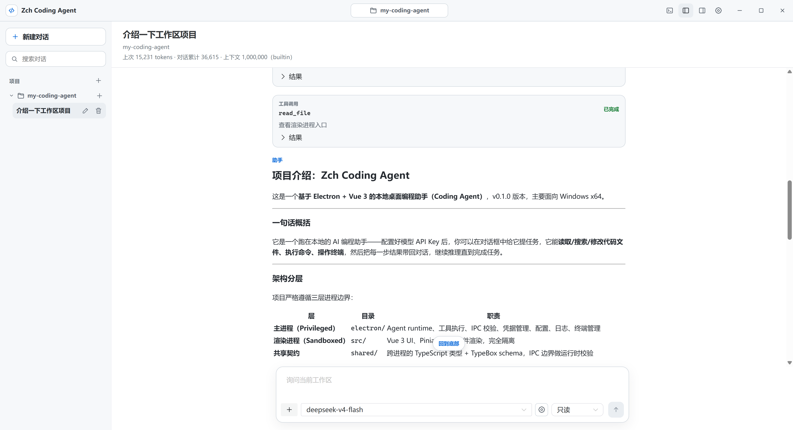

# Zch Coding Agent

安装：普通用户可以直接在 GitHub Releases 下载 `Zch Coding Agent-Windows-*-Setup.exe` 安装包并运行安装；当前发布目标是 Windows x64。开发者需要 Node.js 24，克隆仓库后执行 `npm ci` 安装依赖，开发模式运行 `npm run dev`；如需本地生成安装包，再执行 `npm run build`，产物会输出到 `release/<version>/`。

使用：启动应用后先选择一个工作区目录，在设置里配置模型服务和 API Key，然后在对话框中提出任务。Agent 会在当前工作区内读取文件、搜索代码、应用补丁、执行命令或打开共享终端；涉及文件写入、命令执行、终端输入等副作用时，会根据当前权限模式进入人工审批、自动审批或全自动执行。日常修改运行 `npm run check`；合并或发布前运行完整的 `npm run verify`。

Headless host 可通过 `npm run build:headless` 构建，然后用 `npm run agent:headless -- run --workspace <dir> --task-file <file> --config <file> --artifacts <dir> --timeout-ms <ms>` 启动。该入口固定为无人审批的 Yolo，stdout 只输出 JSONL，运行结果和 patch 写入 workspace 外的 artifacts 目录。真实 Provider 测试仍是高成本 opt-in 工作负载，不属于 `npm run verify`。

## 项目简介

Zch Coding Agent 是一个基于 Electron + Vue 3 的本地桌面编程助手。
它是一个本地 Coding Agent：模型可以通过受控工具查看代码、修改文件、运行命令、操作持久终端，并把每一步结果回传到下一轮推理。



## 核心能力

- 工作区级 Agent 会话：每个会话绑定一个本地目录，文件工具会检测规范化路径、真实路径和 symlink 逃逸。
- 多轮工具调用：支持模型原生 tool use，能连续读取、搜索、修改、执行命令，直到模型产出最终回复。
- 权限模式：支持 ReadOnly、Auto、Confirm、Yolo 四档模式，副作用工具会经过确定性策略、自动审批或人工确认。
- 文件工具：`read_file`、`list_dir`、`glob`、`grep`、`create_file`、`apply_patch`、`delete_file`，带分页、字节上限、diff 预览和执行前 precondition 复核。
- 命令与终端：`run_command` 用于短命令和一次性进程执行，长跑测试、服务、watch 和 REPL 使用持久 PTY，并通过 `delay` + `terminal_read` 轮询输出。
- 项目与代码智能：`.zch/project-model.json` 保存项目模块和 Serena 配置；`code_*` 工具可通过 Serena 定位符号、定义、引用和诊断，定义查询会尽量返回函数/类代码上下文。
- 安全凭据：Provider API Key 存在 Electron `safeStorage`，不会暴露给 renderer、trace 文件或子进程环境。
- 可观测性：可选择开启 JSONL trace，记录请求、响应、工具、审批和 usage，并支持离线回放、fork、统计及完整会话时间线；只读 `zch-session-transcript` Markdown 会包含内部编排、明文 reasoning、工具与 Provider 上下文，导出前每次提示其未经敏感信息扫描或脱敏。
- 可配置提示词：内置中英文 system prompt，设置页可编辑，界面语言会选择对应提示词。
- Skills：支持安装、扫描和启用本地 Skill 指令文件，通过按需读取减少常驻上下文开销。
- Generic MCP：支持手写 stdio server 配置、逐 server 启停与启动信任；模型通过三个固定 gateway 工具分页发现和调用外部工具，调用继续经过现有权限与 trace 管线。
- Headless host：复用桌面端同一 Node Agent Runtime，提供固定 Yolo 的程序化 API/CLI、JSONL 事件、原子 result/identity、usage/tool 指标、Git patch 和自动 Plan continuation；parity fixture 持续校验 Electron/Headless 的 Provider、prompt、tool、compact、Plan、MCP 和 patch 语义。

### MCP 配置示例

在 Electron `userData/config.json` 的 `mcpServers` 数组中手写配置，然后从设置页的“MCP 连接”重新加载并信任启用。敏感值请通过 `envFromHost` 引用主机环境变量，不要写入 `env`。

```json
{
  "mcpServers": [
    {
      "id": "example",
      "label": "Example tools",
      "description": "Workspace-local example MCP server",
      "enabled": false,
      "scope": "workspace",
      "transport": "stdio",
      "command": "node",
      "args": ["${workspace}/scripts/example-mcp.mjs"],
      "env": { "LOG_LEVEL": "warn" },
      "envFromHost": { "API_TOKEN": "EXAMPLE_API_TOKEN" },
      "startupTimeoutMs": 10000,
      "toolTimeoutMs": 30000
    }
  ]
}
```

## 技术栈

- 桌面框架：Electron 42，主进程负责 privileged runtime，preload 通过 `contextBridge` 暴露冻结的 `window.agentApi`。
- 前端：Vue 3、Vite、TypeScript、Pinia、Naive UI、Vue I18n。
- Agent Runtime：自研 session manager、tool registry、permission pipeline、policy engine、context budget 和 Provider adapter。
- 模型接入：DeepSeek / OpenAI-compatible HTTP provider，支持模型目录刷新、reasoning 配置、自动审批模型和 usage 记录。
- 工具执行：Node.js `child_process`、`node-pty`、受控文件系统 API、bounded stdout/stderr、worker thread 正则搜索。
- 安全与契约：TypeBox + AJV runtime schema、sender validation、workspace path guard、TOCTOU precondition、敏感数据过滤。
- 测试：Vitest、Vue Test Utils、Playwright Electron E2E、native PTY smoke test。
- 构建发布：Vite Electron build、electron-builder、Windows NSIS installer、GitHub Actions CI / Release workflow。

## 架构概览

```text
Renderer (Vue + Pinia, sandboxed)
        |
        | frozen preload bridge: window.agentApi
        v
Electron main process
  - IPC validation
  - SessionManager / Agent loop
  - Provider adapter
  - Permission pipeline
  - Tool registry and executors
  - Config, safeStorage, JSONL trace
        |
        v
Workspace files, child processes, PTY terminals
```

## 常用命令

```powershell
npm ci
npm run dev
npm run check
npm run verify
npm run test:e2e
npm run build:headless
npm run build
```

`npm run check` 会并行运行 lint、format check、`npm test` 和 typecheck；一个任务失败不会取消其他任务，结束后会按任务分组输出全部错误。`npm run verify` 是合并与发布门禁，在 `check` 之上增加 native/ripgrep/development SQLite smoke、应用与 Headless 构建、Windows x64 打包、packaged SQLite smoke 和基于现有构建产物的 Electron E2E。不要在所选门禁通过后重复运行它已经包含的底层命令，除非正在定位失败。

GitHub CI 对普通分支 push 只运行快速检查；PR、`master` push 和手动触发会在独立 Windows runner 上并行运行 runtime smoke、Electron E2E 与 Windows package smoke，并等待所有任务报告结果。直接合并而不使用 PR 时，应先在本地运行 `npm run verify`，否则完整门禁只能在 `master` 更新后发现问题。

`test:real` 只在明确需要真实 Provider 环境时手动运行；常规开发、CI 和 Release 均不会隐式触发。

Headless config 只保存 credential 环境变量名称，不接受明文 key。例如：

```json
{
  "schemaVersion": 2,
  "provider": {
    "id": "openai-compatible",
    "providerType": "generic.chat-completions",
    "baseURL": "https://provider.example/v1",
    "model": "coding-model",
    "reasoning": "high",
    "credentialEnv": "HEADLESS_PROVIDER_API_KEY"
  },
  "maxAutoPlanApprovals": 1
}
```

真实 Provider 测试默认不会进入 `npm test`，需要显式设置环境变量后运行：

```powershell
$env:DEEPSEEK_API_KEY = '...'
npm run test:real
```

## 数据库、备份与恢复

Desktop 的 Project、Session、Message 和 FileChange 审计只以 Electron `userData/agent.db` 为持久化真相源；Windows 安装版通常位于 `%APPDATA%\Zch Coding Agent\agent.db`，设置中的“打开数据目录”以运行时实际路径为准。SQLite 使用 WAL 模式，运行时可能同时存在 `agent.db-wal` 和 `agent.db-shm`。

做一致备份前应完全退出应用，确认没有 Zch Coding Agent 进程，再复制整个 `userData` 目录，至少保留 `agent.db`、`config.json`、`secrets.json` 和 `traces/`。如果必须在应用运行时复制，需要把数据库及同名 `-wal`/`-shm` 文件作为一个不可拆分的快照；单独复制 `agent.db` 可能缺少尚未 checkpoint 的提交。`secrets.json` 由操作系统 `safeStorage` 保护，不保证可跨 Windows 账户或机器恢复。

启动时若数据库无法打开或迁移，应用会显示原生阻塞恢复窗口，只提供重试、打开数据目录和退出，不会回退到旧 Workbench/JSON 状态。恢复时先退出应用并备份故障目录，再用同一次一致备份替换数据库文件；高版本 schema、checksum 不匹配或损坏数据库会 fail closed。未发布的 v8/v9 开发配置不做保字段迁移；首个正式 v9 发布之后的配置变化必须升版本并另行定义迁移策略。

## 安全边界

桌面产品的安全模型是“本地应用 + 明确审批 + 工作区路径边界”，不是容器级 sandbox。文件工具会限制在 workspace 内，并对真实路径和资源状态做复核；但桌面端 `run_command` 和持久终端本质上仍是主机进程执行能力，因此在 Auto / Yolo 模式下需要用户明确接受风险。

## 当前状态

当前版本以 Windows x64 为主要桌面发布目标，已覆盖桌面 UI、DeepSeek、Generic Chat Completions、Generic Responses 与 Generic Anthropic Provider、文件/命令/终端工具、权限审批、上下文预算、可配置提示词、Skills 管理、Generic MCP gateway、固定 Yolo Headless host、Electron/Headless parity、只读 Subagent、模型池、Run-scoped Desktop Swarm、Agents 运行状态与完整 Session transcript。ProjectModel 与 Serena 代码智能目前暂停，待完成 Swarm hardening 后迁移到 SQLite 再恢复；后续方向还包括 Google 与具体厂商 Provider、插件加载器与 IDE 级编辑能力。
