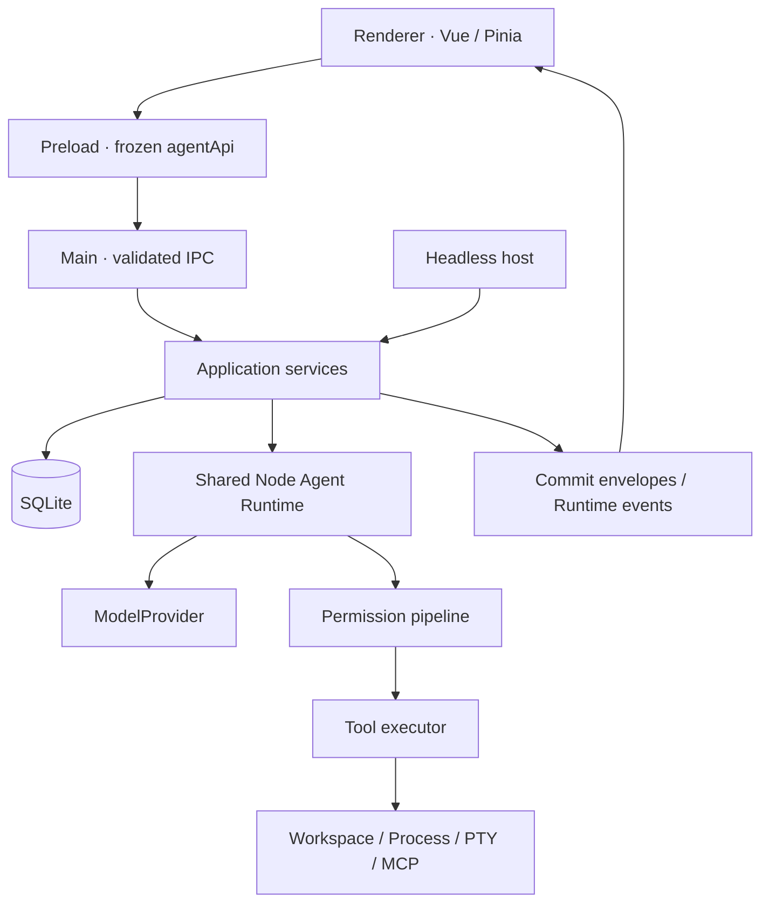

# 架构总览

本文规定已采纳的进程边界、状态所有权和核心不变量。具体实现位置见 [Code map](./code-map/README.md)，产品范围见[需求文档](./requirements.md)，历史理由见[决策索引](./decision-log.md)。

## 系统结构

Desktop 与 Headless 都从 `createBackendRuntime` 组装后端，通过 `createAgentRuntime` 创建唯一 Agent loop。宿主提供配置、凭据、事件和生命周期适配；业务实现不另起一套执行循环。

## 进程与依赖边界

| 位置                                     | 责任                                               | 依赖约束                                           |
| ---------------------------------------- | -------------------------------------------------- | -------------------------------------------------- |
| `shared/`                                | Canonical records、配置和 IPC schema、进程中立类型 | 不依赖 Node、Electron、Vue、数据库或 Provider 实现 |
| `electron/application/`                  | 业务命令、查询、事务与 Runtime 协调                | IPC 不得绕过它直接修改数据库或 Runtime map         |
| `electron/persistence/`                  | SQLite 连接、迁移、Repository 和 Codec             | 不转换 Provider 协议，不发布业务事件               |
| `electron/session/`、`electron/runtime/` | Session/Run、历史编译与执行编排                    | 通过注入端口访问宿主和 durable state               |
| `electron/tooling/`                      | Tool framework                                     | 不反向依赖内置业务工具                             |
| `electron/tools/`                        | 内置工具定义和业务适配                             | 文件基础能力经 common filesystem，权限经统一管线   |
| `src/`                                   | Vue UI、后端副本和瞬时展示                         | 不访问文件系统、数据库、Provider 或密钥            |

配置按八个领域、IPC 按九个领域拆分；公开 `agentApi` 由显式 capability manifest 派生。详细规则见[依赖边界](./architecture/boundaries.md)。这些约束由 [architecture-boundaries.test.ts](../electron/architecture-boundaries.test.ts) 和 [ESLint 配置](../eslint.config.js) 持续检查。

## 状态所有权

| 状态                                                       | 所有者                        | 恢复语义                                                |
| ---------------------------------------------------------- | ----------------------------- | ------------------------------------------------------- |
| Project、Session、完整 Message、Goal/Plan、Agent execution | Backend + SQLite              | 重启后恢复已提交记录                                    |
| Active Run、partial stream、pending approval、进程句柄     | Backend memory                | 主进程存活时可同步快照；崩溃后不重建进程和 partial 输出 |
| Terminal/Command/Agent 等输出与 scratch                    | Backend + Session temp files  | 可过期或捕获失败，不代替数据库与 PTY ownership          |
| 分页消息和实体副本                                         | Renderer replica              | 从后端查询和 commit envelope 重建                       |
| Draft、附件选择、滚动、布局与当前选择                      | Renderer UI                   | 不承诺刷新或切换后恢复                                  |
| Git Review                                                 | 当前 Project 工作树的临时查询 | 按需刷新，不落入 SQLite 或 Session 历史                 |

Durable command 在 transaction 中提交完整记录，成功后才发布 `DurableCommitEnvelope`。回包和 push 事件携带同一 envelope，顺序不作保证；Renderer 通过同一 reconciler 按 cursor/revision 幂等处理。数据库提交失败不能成为 UI 中的已提交事实。

## 核心不变量

1. **Canonical schema 定义一次。** IPC、Codec 和 Renderer 使用 shared 契约；wire payload 只存在于 Provider 边界。
2. **完整记录才持久化。** Message 历史保留完整 turn/tool batch；stream delta 不写成半条 canonical message。
3. **上下文变化可审计。** Runtime context、AGENTS、selected context 和编排追加新层；显式 compact、rewind 等操作遵守各自历史契约，不能通过 UI 展示逻辑偷偷改写历史。
4. **每个 Tool call 都有结果。** 拒绝、取消、错误和 timeout 均收敛；parallel body 的结果按原 call 顺序提交，serial Tool 构成完成屏障。
5. **授权与执行校验分开。** 批准绑定 tool/call/完整 args；执行期仍检查路径、资源归属和参数。Yolo 也不绕过调用有效性条件。
6. **文件写入采用 latest-content/last-writer-wins。** 精确补丁无匹配或歧义时零写入；原子发布防止半文件，不提供并发合并、FileChange 或恢复历史。
7. **凭据留在受信任边界。** Renderer 不读取已保存 API Key；请求凭据不进入日志、Trace 或子进程环境。完整 Trace 仍可能包含用户和工作区敏感内容。
8. **后台任务有独立生命周期。** 已启动 Agent/PTY 不随父 Run 结束或取消而关闭；显式 background cancel、worker timeout、Session/Project 清理和宿主退出负责收敛。
9. **范围和资源有界。** 单 Session 单 Active Run；无产品级全局 Run 或 workspace writer lock。Session active leaf、Tool 输出、网络和进程读取仍有各自边界。

## 专题规范

| 主题                                                           | 内容                                        | 对应地图                                             |
| -------------------------------------------------------------- | ------------------------------------------- | ---------------------------------------------------- |
| [状态与 IPC](./architecture/state-and-ipc.md)                  | Record 语义、事务、分页、幂等与重同步       | [状态地图](./code-map/state-and-ipc.md)              |
| [Session 与 Run](./architecture/sessions.md)                   | 首次发送、重试、继续、编排和取消            | [Runtime 地图](./code-map/runtime.md)                |
| [Provider 与 Context](./architecture/providers-and-context.md) | 历史编译、continuation、Prompt 和 compact   | [Provider 地图](./code-map/providers-and-context.md) |
| [工具与权限](./architecture/tools-and-permissions.md)          | 参数、路径、审批、执行与输出契约            | [工具地图](./code-map/tools-and-permissions.md)      |
| [集成与 Artifact](./architecture/integrations.md)              | Terminal、Skills、MCP 与临时文件            | [宿主地图](./code-map/integrations-and-hosts.md)     |
| [Agent execution](./architecture/agent-execution.md)           | Subagent、Swarm、后台任务与 Headless parity | [Agent 地图](./code-map/agent-execution.md)          |
| [可观测性](./architecture/observability.md)                    | Operational Log、Trace、Transcript 与隐私   | [宿主地图](./code-map/integrations-and-hosts.md)     |

交互与视觉要求见[前端规范](./frontend-spec.md)。验证要求见[测试指南](./guides/testing.md)。已完成的切流和旧 schema 演进见[迁移档案](./archive/backend-migrations.md)，不再作为当前开发步骤。
