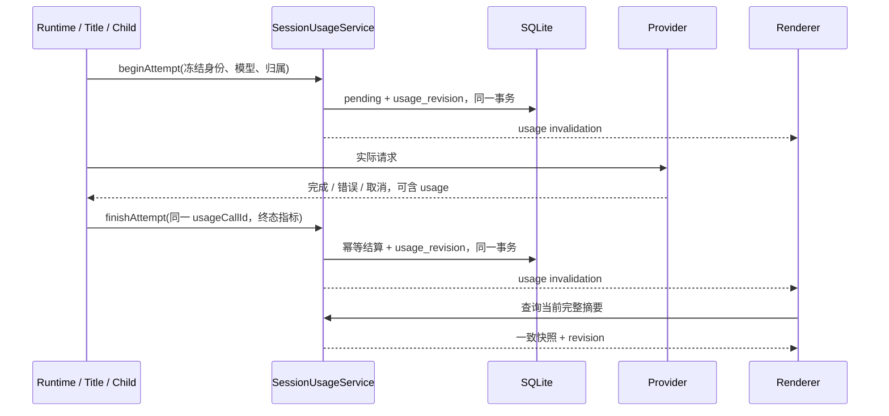

# Session usage 统计实现计划

- 状态：待评审，未实施。
- 日期：2026-09-10。
- 代码基线：`ce90f49`，数据库 migration 最新为 `0013_project_artifacts`。
- 本次交付：设计文档。本文的表、接口、文件名和默认口径均为提案，不代表已经实现或已经采纳。
- 范围：Session Token 统计、最近一次上下文占用、后端恢复和前端显示缓存。输入草稿独立处理。

返回[路线图](../road-map.md)。现行约束见[状态与 IPC](../architecture/state-and-ipc.md)、[Provider 与 Context](../architecture/providers-and-context.md)和[前端工作台](../frontend/workbench.md)。现有显示问题见[开放问题](../open-design-questions.md#1-上下文占用进度条的数据语义)。

## 1. 目标与建议方案

目标是让同一个 Session 在切换、Renderer reload、应用重启和后台 Agent 继续工作后，都能显示同口径的用量。缺失信息必须可识别，不能因为刷新而从头累计，也不能重复计算一个实际请求。

建议以 SQLite 中的逐请求记录为统计依据，后端计算完整摘要，前端 Store 保存摘要副本，并用 localStorage 缓存最近一次显示结果。

| 数据                | 含义                                                      | 所有者 | 生命周期                                            |
| ------------------- | --------------------------------------------------------- | ------ | --------------------------------------------------- |
| Session 累计        | 本 Session 实际发起及委派的 Provider 请求所报告的 Token   | 后端   | Run 结束、回退、压缩不清零；永久删除 Session 时删除 |
| 当前或最近 Run 用量 | 归属于指定顶层 Run 的请求用量，包括它启动的后台任务       | 后端   | 后台任务完成后仍可能更新这个 Run 的统计             |
| 最近上下文观测      | 最近一次顶层 main 请求的输入 Token / 当时冻结的上下文窗口 | 后端   | 保留最近观测；压缩、回退、模型变更使旧观测过期      |
| 显示缓存            | 上述摘要的最后一个已知版本                                | 前端   | 可丢弃、可由后端重建，不参与运行决策                |

本阶段不做价格换算、账单对账、Token 预算控制、趋势图、调用内容查看或草稿持久化。统计描述应用观察到的请求和 Provider 报告值，不承诺等同于 Provider 最终账单。

## 2. 已核对的现状

| 位置                                                                                                                                                                                       | 当前行为                                                                            | 对新实现的影响                                           |
| ------------------------------------------------------------------------------------------------------------------------------------------------------------------------------------------ | ----------------------------------------------------------------------------------- | -------------------------------------------------------- |
| [ConversationHeader.vue](../../src/components/chat/ConversationHeader.vue)                                                                                                                 | 从 `agent.usage` 找最近一条 main；没有 main 时整块隐藏；下方累计当前 overlay 的记录 | 显示依赖实时事件，累计尚不是 Session 全生命周期          |
| [agent-runtime-events.ts](../../src/stores/agent-runtime-events.ts)                                                                                                                        | `llm.usage` 追加到 overlay；新 Run 清空旧数组；Session 卸载删除 overlay             | 普通切换可能保留，刷新或重建后无法恢复                   |
| [runtime-state.ts](../../shared/runtime-state.ts)                                                                                                                                          | `ActiveRunPublicSnapshot` 不含 usage                                                | 后端仍在运行也无法通过当前快照补齐显示                   |
| [session-provider-turn.ts](../../electron/session/session-provider-turn.ts)                                                                                                                | main 成功结果规范化后进入 `run.usageRecords`、Trace 和事件                          | 成功路径已有入口，失败和缺失 usage 需要单独建模          |
| [session-run-controller.ts](../../electron/session/session-run-controller.ts)                                                                                                              | 助手消息 `metadata.usage` 保存部分规范化 Token 指标                                 | 可证明部分历史消耗，但不足以重建完整请求归属和上下文窗口 |
| [session-compact-coordinator.ts](../../electron/session/session-compact-coordinator.ts)                                                                                                    | 压缩 usage 写入运行记录、事件和压缩消息                                             | 需要纳入统一记录，不能与 main 上下文观测混用             |
| [session-tool-runner.ts](../../electron/session/session-tool-runner.ts)                                                                                                                    | 审批 usage 写日志和事件，目前未完整进入 `run.usageRecords`                          | 不能直接把现有内存数组当全量统计                         |
| [conversation-titling-service.ts](../../electron/application/conversation-titling-service.ts)                                                                                              | 标题调用独立于前台 Run 收尾，已有 operational attempt 日志                          | 标题消耗需要独立归属及持久记录                           |
| [session-events.ts](../../electron/session/session-events.ts)、[execution-service.ts](../../electron/subagent/execution-service.ts)、[coordinator.ts](../../electron/swarm/coordinator.ts) | child usage 会转发到父会话，也有执行结束汇总                                        | 转发事件、child 记录、root 汇总不能重复计费              |
| [cloneForkMessage](../../electron/application/session-branch.ts)                                                                                                                           | 分叉复制消息，包括原 metadata                                                       | 不能直接扫描所有助手消息后声称得到了真实请求累计         |

当前 schema 已有 `projects`、`sessions`、`messages`、`subagent_executions` 和 `subagent_sessions`，没有独立的 durable Run 表或完整 Provider 请求用量表。新方案不以 Trace 文件为统计数据库，关闭日志不影响统计。

## 3. 需要决策的内容

以下实现细节按“推荐选项”展开；每项仍待确认。

| 编号 | 问题                   | 推荐选项                                                                | 其他选项及影响                                                           |
| ---- | ---------------------- | ----------------------------------------------------------------------- | ------------------------------------------------------------------------ |
| D1   | 页头累计范围           | Session 全生命周期累计；另提供当前/最近 Run 摘要                        | 沿用仅当前 Run，改动更小，但会话总消耗仍不可见                           |
| D2   | 是否包含辅助调用       | 包含 main、approval、compression、title、subagent；明细可区分           | 只计 main，数字更简单，但低于任务实际消耗                                |
| D3   | 后台子代理归属         | 只在实际 Provider 调用处记一笔，归属启动它的公开 Session 和顶层 Run     | 把父转发或结束汇总再记账会重复计数，不建议                               |
| D4   | 旧数据回填             | 首版不自动回填；旧 Session 标明“自升级后累计，历史未完整记录”           | 回填可确认的旧消息指标，但需要独立 provenance 与覆盖率设计，不能保证全量 |
| D5   | 回退、分叉是否继承消耗 | 回退不减累计；fork 从零累计新发生的请求，不复制父会话消耗               | 按当前可见历史重算，会把已发生消耗抹掉或复制                             |
| D6   | 上下文进度条口径       | 最近一次顶层 main 请求的输入 Token，占当时冻结窗口的比例                | 估算下一次完整请求需额外 tokenizer/context 编译工作，不纳入本阶段        |
| D7   | localStorage 缓存      | 保存小型摘要；恢复后先显示上次结果，再向后端校准                        | 只用 Pinia 内存也可正确恢复，但重启时需等待查询才显示                    |
| D8   | 数据库形态             | 两张表：请求事实表和 Session 统计状态表；聚合按需计算                   | 再加累计表可加速，代价是每次写入都要维护第二套计数一致性                 |
| D9   | 统计写入失败           | 请求前写入失败则不发请求；响应后失败保留非重试错误，不自动重发 Provider | 静默跳过可提高可用性，但必须长期暴露统计不完整状态，首版不建议           |
| D10  | 明细保留               | 与 Session 一起保留，不跟随 Trace/临时产物回收                          | 定期压缩明细需要可验证的汇总和去重保留策略，另行设计                     |

优先确认 D1、D2、D4、D5、D6；它们决定用户看到的数字含义。D8、D9决定实现复杂度和故障行为。

## 4. 统计语义

### 4.1 一笔记录对应一次已登记的请求 attempt

模型工具调用、一次 Run、一次成功的助手消息，都不等于一次 Provider 请求。自动重试发出新的网络请求，应创建新的 attempt 记录；同一结果重复投递则复用原 attempt ID。

- 在实际调用 Provider 之前分配 `usageCallId`，并传递到成功、失败、取消和最终落盘路径。
- 保留原有 `logicalCallId` 和 `attemptIndex` 用于诊断，不把工具 call ID 直接当成全局唯一的模型请求 ID。
- 现有 main 每次重试已经生成新的 `llmCallId`，可直接复用为 attempt 身份；压缩 native→synthetic 回退会重置 attempt 序号，因此必须用实际请求 ID 去重。审批目前复用工具 call ID，标题使用派生 ID，接入时为它们补独立请求身份。
- 请求编译、schema 校验等尚未开始请求的失败不创建消耗记录。
- 开始请求后失败或取消但没有收到 usage：记录状态，Token 字段保持未知。
- 已收到 usage，即使业务解析失败、用户取消、标题未采用，也保存 Provider 报告的消耗。
- 重启发现未结算 attempt：标记 `interrupted`，保留未知状态，不自动重发请求。

`attemptCount` 的准确含义是“已登记的请求尝试数”。pending 提交与调用 Provider 之间仍可能取消或崩溃，因此不能把它声称为精确的已发送数或已计费数；未结算记录在恢复时保持“是否实际发出/消耗未知”。只有已收到的 Provider usage 才参与已知 Token 累计。崩溃发生在 Provider 接收请求与本地落盘之间时，同样无法凭本地信息还原账单，应如实保留缺口。

### 4.2 缺失值、累计和覆盖率

沿用 [LlmUsageRecord](../../shared/usage.ts) 的六项指标：`promptTokens`、`completionTokens`、`totalTokens`、`reasoningTokens`、`cacheHitTokens`、`cacheMissTokens`。

- 数据库使用 nullable integer；`NULL` 表示没有报告，`0` 表示明确报告为零。
- 每项摘要返回 `knownTotal`、`reportedCalls`、`derivedCalls`、`unreportedCalls` 和 `complete`。三类调用数之和等于该范围的 attemptCount，pending 也属于尚未报告；`complete` 只表示本次采集范围内没有未知值。既没有报告值也没有合法推导值时，`knownTotal = null`；没有任何请求时可显示零。
- 明确区分“历史未完整采集”和“某次请求缺少指标”。升级后的报告完整，也不能消除旧历史缺口。
- `totalTokens` 优先使用 Provider 提供的规范化总量。缺失时，只在同一请求的输入、输出都已知时推导，并在摘要标明推导；不使用两个不同请求的残缺指标拼总量。
- reasoning 通常已包含在 completion 的口径中；不额外加到 total。缓存命中/未命中是输入的分解，不额外加到 prompt。
- 缓存命中率只使用同时具有 hit 和 miss 的请求，计算 `sum(hit) / sum(hit + miss)`，附覆盖率；分母为零或没有可用样本时显示未知。
- 原始缺失值不写回成零；不强加不同 Provider 都满足完全相同的字段等式。
- [normalizeChatUsage](../../electron/providers/chat-completions-shared.ts) 目前会用 prompt 减去 cache hit 推导 cache miss，甚至将缺少的 hit 按零参与推导。新采集必须保留逐指标来源：已报告、合法推导、未知；缺少 hit 时不能把 prompt 全量声称为已知 cache miss。调整规范化契约及测试，并核对既有展示和自动压缩消费者，不能在持久化时把推导值冒充直接报告值。
- 单条数值沿用现有上限；聚合及 IPC 序列化检查安全整数范围，超界必须显式报告，不静默舍入。

### 4.3 子代理与 scope

数据库分别保留“谁发起请求”和“请求用途”：

- `producerKind = session | subagent`：实际运行的是公开会话还是隐藏 child。
- `purpose = main | approval | compression | title`：该请求在实际会话内的用途。
- `ownerSessionId`：最终归属的公开 Session。
- `ownerRunId`：触发这项工作的顶层 Run；child 自己的 Run ID 另存。

展示时，公开会话的用途映射为对应 scope；所有 child 请求在一级汇总归入 `subagent`，内部仍保留实际 purpose。`byScope` 五项互斥，相加才是 Session 总量。

Swarm coordinator 的汇总和父会话收到的 `llm.usage` 转发仅作兼容展示，不再作为写库入口。后台任务在父 Run 结束后继续产生的用量仍归原 Run，不计入后来开始的 Run。公开查询不返回 hidden Session ID。

## 5. 数据库变更

### 5.1 Migration 与既有表

拟新增 `electron/persistence/migrations/0014_session_usage.sql`，并注册到 [migration registry](../../electron/persistence/migrations/index.ts)。实际实施时重新确认编号；不修改已经发布的 migration。

| 表                    | 变更                                                                                              |
| --------------------- | ------------------------------------------------------------------------------------------------- |
| `llm_usage_calls`     | 新增，记录请求身份、归属、冻结模型信息、状态及 nullable Token 指标                                |
| `session_usage_state` | 新增，记录独立版本、采集范围、最近 Run 和上下文观测状态                                           |
| `sessions`            | 不增加累计 Token 列；usage 更新不修改其 revision/updated_at，避免影响消息命令的并发校验和侧栏排序 |
| `messages`            | 保留现有 metadata.usage；不以它作为新增累计的第二个入口，不修改历史消息                           |
| `subagent_executions` | 保留旧 usage_json/result_json 兼容读；不把汇总再导入新事实表                                      |

两张新表使用现有 SQLite `STRICT`、外键和事务约束。下面是评审用 DDL 草案，不是本次要执行的 SQL。

### 5.2 请求事实表

```sql
CREATE TABLE llm_usage_calls (
  schema_version INTEGER NOT NULL DEFAULT 1 CHECK (schema_version = 1),
  id TEXT PRIMARY KEY CHECK (length(id) BETWEEN 1 AND 128),
  owner_session_id TEXT NOT NULL REFERENCES sessions(id) ON DELETE CASCADE,
  owner_run_id TEXT,
  source_session_id TEXT REFERENCES sessions(id) ON DELETE SET NULL,
  source_run_id TEXT,
  source_execution_id TEXT REFERENCES subagent_executions(id) ON DELETE SET NULL,
  producer_kind TEXT NOT NULL CHECK (producer_kind IN ('session', 'subagent')),
  purpose TEXT NOT NULL CHECK (purpose IN ('main', 'approval', 'compression', 'title')),
  logical_call_id TEXT NOT NULL CHECK (length(logical_call_id) BETWEEN 1 AND 128),
  attempt_index INTEGER NOT NULL CHECK (attempt_index >= 1),
  provider_id TEXT NOT NULL CHECK (length(provider_id) BETWEEN 1 AND 128),
  provider_type TEXT NOT NULL CHECK (length(provider_type) BETWEEN 1 AND 128),
  provider_label TEXT NOT NULL CHECK (length(provider_label) BETWEEN 1 AND 128),
  model TEXT NOT NULL CHECK (length(model) BETWEEN 1 AND 256),
  context_window_tokens INTEGER NOT NULL
    CHECK (context_window_tokens BETWEEN 1 AND 10000000),
  context_window_source TEXT NOT NULL
    CHECK (context_window_source IN ('override', 'builtin', 'default', 'provider')),
  context_epoch INTEGER NOT NULL CHECK (context_epoch >= 0),
  request_state TEXT NOT NULL
    CHECK (request_state IN ('pending', 'completed', 'failed', 'cancelled', 'interrupted')),
  prompt_tokens INTEGER CHECK (prompt_tokens BETWEEN 0 AND 10000000000),
  completion_tokens INTEGER CHECK (completion_tokens BETWEEN 0 AND 10000000000),
  total_tokens INTEGER CHECK (total_tokens BETWEEN 0 AND 10000000000),
  reasoning_tokens INTEGER CHECK (reasoning_tokens BETWEEN 0 AND 10000000000),
  cache_hit_tokens INTEGER CHECK (cache_hit_tokens BETWEEN 0 AND 10000000000),
  cache_miss_tokens INTEGER CHECK (cache_miss_tokens BETWEEN 0 AND 10000000000),
  metric_sources_json TEXT NOT NULL DEFAULT '{}'
    CHECK (json_valid(metric_sources_json) AND json_type(metric_sources_json) = 'object'),
  started_at TEXT NOT NULL CHECK (length(started_at) BETWEEN 1 AND 64),
  finished_at TEXT CHECK (finished_at IS NULL OR length(finished_at) BETWEEN 1 AND 64),
  CHECK ((request_state = 'pending' AND finished_at IS NULL)
    OR (request_state <> 'pending' AND finished_at IS NOT NULL))
) STRICT;

CREATE INDEX llm_usage_owner_run_idx
  ON llm_usage_calls(owner_session_id, owner_run_id);
CREATE INDEX llm_usage_owner_scope_idx
  ON llm_usage_calls(owner_session_id, producer_kind, purpose);
CREATE INDEX llm_usage_source_idx
  ON llm_usage_calls(source_session_id, source_run_id);
CREATE INDEX llm_usage_pending_idx
  ON llm_usage_calls(request_state) WHERE request_state = 'pending';
```

字段约束补充：

- `id` 是实际 attempt 的稳定应用 ID，重试数据库操作时复用。主键负责幂等；`logical_call_id` 可跨多个 attempt 复用。
- `owner_run_id/source_run_id` 没有 Run 表可引用。新运行路径必须提供；只有明确没有 Run 的应用辅助工作才允许为空，计入 Session 而不捏造 Run。
- `owner_session_id` 必须是公开 Session，source/owner/execution 必须属于同一 Project。由后端应用服务依据已登记运行关系校验，Renderer 不能指定记账归属。
- source 外键使用 `SET NULL`，使后续 child 清理不抹掉父会话已发生的消耗；owner 永久删除才级联删除事实。
- 冻结 Provider/model/window 字段在调用时填写，不外键关联可编辑配置；删除 Provider 后仍可解释历史统计。
- `metric_sources_json` 仅允许六个指标键和值 `reported | derived`，由 shared schema 校验，且必须与非 NULL 数值一一对应。它不保存 Provider raw payload；终态仍为未知的字段没有来源项。
- `context_epoch` 是实际 source Session 的上下文代次。只有顶层 main 的记录参与父会话上下文进度条。
- 不保存 prompt、response、reasoning、API key、headers、endpoint 或任意 raw JSON。诊断内容继续走既有日志边界。

### 5.3 Session 统计状态表

```sql
CREATE TABLE session_usage_state (
  schema_version INTEGER NOT NULL DEFAULT 1 CHECK (schema_version = 1),
  session_id TEXT PRIMARY KEY REFERENCES sessions(id) ON DELETE CASCADE,
  stats_id TEXT NOT NULL UNIQUE CHECK (length(stats_id) BETWEEN 1 AND 128),
  usage_revision INTEGER NOT NULL DEFAULT 0 CHECK (usage_revision >= 0),
  collected_since TEXT NOT NULL CHECK (length(collected_since) BETWEEN 1 AND 64),
  historical_coverage TEXT NOT NULL
    CHECK (historical_coverage IN ('complete', 'since_upgrade')),
  latest_run_id TEXT,
  context_epoch INTEGER NOT NULL DEFAULT 0 CHECK (context_epoch >= 0),
  context_profile_key TEXT
    CHECK (context_profile_key IS NULL OR length(context_profile_key) = 64),
  latest_context_call_id TEXT REFERENCES llm_usage_calls(id) ON DELETE SET NULL,
  context_invalidated_reason TEXT
    CHECK (context_invalidated_reason IN ('compaction', 'rewind', 'model_change')),
  updated_at TEXT NOT NULL CHECK (length(updated_at) BETWEEN 1 AND 64)
) STRICT;
```

`stats_id` 是首次创建统计状态时生成的随机 ID，数据库重启后不变。重建统计状态会产生新 ID，用于区分浏览器中的旧缓存。

该表不存 Token 累计副本：累计从事实表聚合。`usage_revision` 随新 attempt、结算、Run 归属变化和上下文失效递增；重复结果不重复递增。它与 `SessionRecord.revision` 独立。

`latest_run_id` 仅由公开 Session 的顶层 Run 启动更新。延迟标题或旧 child 完成不能把它切回旧 Run。`latest_context_call_id` 只能指向同一 owner 的顶层 main 请求，应用服务在同一事务检查并更新。

`context_profile_key` 是有效 Provider/model/reasoning/window 配置的确定性摘要，不包含凭据或 endpoint。Run 冻结路由时比较它；配置在 JSON ConfigStore 中变化的情形于下一次有效路由解析时使旧观测失效，不尝试把 ConfigStore 与 SQLite 拼成跨存储事务。仅标签改名不使上下文失效。

### 5.4 初始化与旧数据库

1. migration 创建表及索引，使用现有 migration runner 的事务与校验流程。
2. 为既有公开 Session 创建状态行；已有历史的行标记 `since_upgrade`，明确采集起点。空会话可标记 `complete`。隐藏 child 不单独创建公开统计状态。
3. 新建公开 Session 和 fork 的事务同时创建状态行；fork 从零开始。`stats_id` 由后端生成，不从 Renderer 或复制消息中取得。
4. 新进程启动将遗留 pending attempt 改为 interrupted，递增受影响 Session 的 usage revision；不推测 Token，也不恢复 Provider 请求。
5. 不删除或重写旧 `metadata.usage`；不自动读取 Trace；不根据复制过的历史消息伪造调用身份。
6. 若选择 D4 的历史回填替代方案，应另写 migration/后台回填设计，包含去重 provenance、缺失范围和重跑检查点，不能只执行一次消息 SUM。

版本回退沿用当前数据库版本保护策略；本计划不设计破坏性 down migration。发布前保留可恢复的数据库备份。

## 6. 写入流程与事务边界

拟新增内部 `UsageAccountingPort`，由 `createBackendRuntime` 注入 runtime、审批和标题服务。对应应用服务建议命名 `SessionUsageService`，Repository 为 `UsageRepository`，分别放在 `electron/application` 和 `electron/persistence`。



### 6.1 各调用入口

| 入口                                                                                                                                    | 接入要求                                                                                                     |
| --------------------------------------------------------------------------------------------------------------------------------------- | ------------------------------------------------------------------------------------------------------------ |
| [session-provider-turn.ts](../../electron/session/session-provider-turn.ts)                                                             | 每个实际 attempt 前登记；成功和携带 usage 的 completion error 都结算；统计故障不得进入 Provider 自动重试分支 |
| [session-compact-coordinator.ts](../../electron/session/session-compact-coordinator.ts)                                                 | 记录压缩请求；压缩成功改变上下文时递增 context epoch；消息 metadata 和统计事实只有一个计数来源               |
| [auto-approver.ts](../../electron/permission/auto-approver.ts)、[session-tool-runner.ts](../../electron/session/session-tool-runner.ts) | 在实际审批 Provider 调用处登记，而不是等工具批准后才统计；危险、格式无效和降级人工的已发生调用仍可有用量     |
| [conversation-titling-service.ts](../../electron/application/conversation-titling-service.ts)                                           | 记录标题请求并关联触发 Run；标题不采用、Run 已结束也不丢弃消耗                                               |
| [execution-service.ts](../../electron/subagent/execution-service.ts)、[swarm/coordinator.ts](../../electron/swarm/coordinator.ts)       | worker 创建时固定公开 owner 和顶层 Run；hidden runtime 复用相同记录入口，父转发和汇总不再记一笔              |

### 6.2 一致性与失败

- `beginAttempt` 必须在发请求前成功提交。`finishAttempt` 将 pending 更新为终态，并在同一事务递增 owner 的 usage revision。
- 同 ID、同终态 payload 再次到达视为 no-op；同 ID 冲突结果给出诊断，不覆盖旧事实或再次累计。只在 Provider 最终规范化完成后结算，不逐个 stream chunk 累加。
- usage 事务独立于助手消息业务提交，使解析失败或消息提交失败后的实际消耗仍有记录。本期按 Session/Run 关联，不提供逐消息到 Provider 请求的对应关系；现有助手 metadata 没有 LLM 请求 ID，不能拿工具 callId 替代。若后续需要逐消息审计，应为新消息增加可选 `usageCallId` 及严格 schema，旧历史保持不变。
- usage 写入失败后的本地重试复用 `usageCallId`，不得再次请求 Provider。响应后最终无法持久化，走明确的 persistence failure 路径；标题等辅助服务保留其既有非阻断业务语义，但必须报告统计缺口。
- 取消并不取消已收到结果的统计结算。关闭顺序先阻止新 attempt，等待在途采集器及结算，再关闭 coordinator 和数据库；补充真实慢结算测试。
- 数据库提交成功后才发布失效通知；发布失败不回滚事实，下一次查询能够恢复。
- 不能依赖现在的 `run.usageRecords` 作为全量入口，它可以保留给兼容消费者；页头切换到新的后端摘要。

## 7. 查询、事件与 IPC

### 7.1 有界摘要契约

拟新增 `shared/session-usage.ts`，集中定义 TypeBox schema。使用标准化数值及公开 Session ID，不暴露 hidden identity、调用内容或数据库路径。

```ts
type TokenAggregate = {
  knownTotal: number | null
  reportedCalls: number
  derivedCalls: number
  unreportedCalls: number
  complete: boolean
}

type UsageTotals = {
  attemptCount: number
  pendingCount: number
  interruptedCount: number
  promptTokens: TokenAggregate
  completionTokens: TokenAggregate
  totalTokens: TokenAggregate
  reasoningTokens: TokenAggregate
  cacheHitTokens: TokenAggregate
  cacheMissTokens: TokenAggregate
}

type SessionUsageSummary = {
  schemaVersion: 1
  sessionId: SessionId
  statsId: string
  revision: number
  collectedSince: string
  historicalCoverage: 'complete' | 'since_upgrade'
  sessionTotals: UsageTotals
  byScope: Array<{ scope: LlmUsageScope; totals: UsageTotals }> // 至多 5 项
  latestRun: { runId: RunId; totals: UsageTotals } | null
  context: ContextObservation | null
}
```

`ContextObservation` 包含 `runId/providerId/providerLabel/model/inputTokens/contextWindowTokens/contextWindowSource/observedAt/contextEpoch`，以及 `state: observed | stale | unknown`、可选失效原因。比例由这些同一请求的数据派生。真实 schema 对字符串、数组和数值设上限，示例类型不直接作为实现。

缓存命中率不能用各项累计直接拼接，否则会混入只报告了一半数据的请求。摘要另返回 `cacheHitRate: { percent: number | null, reportedPairs, derivedPairs, missingPairs }`，按第 4.2 节在后端计算。每项指标的 complete 不代表历史覆盖完整，界面同时使用 historicalCoverage。

首次版本只返回固定 scope 分类和顶层 Run 摘要；无限长度的模型/请求明细不进入 Session 快照。以后若需要按 Provider/model 展开，增加有界分页查询。

### 7.2 接口与主进程装配

- 新增只读 `session:usage:get`，公开窄 API `getSessionUsage({ version: 1, sessionId })`，返回 `{ summary, cursor }`。
- 在 [SessionSnapshot](../../shared/session.ts) 添加 usage 摘要，使首次加载也能恢复；摘要与 Session/message page 在同一个 coordinator query 中采样。
- `session:usage:get` 的事务游标只说明采样位置；前端不能用局部查询的 cursor 跳过尚未处理的全局 durable commits。
- 调整 [sessions IPC](../../shared/ipc/sessions.ts)、[registry](../../shared/ipc/registry.ts)、[capability manifest](../../shared/agent-api.ts)和 [app handlers](../../electron/ipc/app-handlers.ts)。读取前校验 sender、payload 和公开 Session 归属。
- 新增字段和 API 随同一 Electron 版本部署，使用现有 IPC version；更新精确 schema 和契约测试，不支持不同版本 Main/Renderer 混用。
- bootstrap 不返回所有历史会话的统计明细。当前选中 Session 通过快照加载，其他会话收到失效通知后按需查询。

### 7.3 失效通知与版本

建议沿用 durable event 通道，新增 `session.usage.changed` topic，payload 为 `{ sessionId, statsId, revision }`。它是“小型失效通知”，不是要让 Renderer 加到计数器上的 delta。

- [ApplicationStateCoordinator](../../electron/application/application-state-coordinator.ts) 的 topic/change 类型需要显式扩展。开始/结算事务返回新的 revision，提交后发布该 topic。
- 主 Run 开始和上下文失效也更新 usage state。若它们已经处于 Session 业务事务中，应复用同一 transaction 更新状态，并让 `session.changed` 携带可选 usage invalidation；不能嵌套 coordinator command 或在两笔事务间留下新上下文配旧摘要的窗口。
- 前端先按既有顺序推进全局 commit cursor，再把失效通知交给独立 usage Store。不能因为新增 topic 未处理而把后续 Session 消息判断成缺口。
- usage Store 保存“已显示 revision”和“已知需要的最高 revision”。同会话合并在途查询；响应低于目标 revision 时继续查询，不能直接丢掉等待期间的新失效通知。
- 同 backend 实例内，旧 query/event 不能覆盖较新的摘要。backend 实例变化后重新查询；数据库备份恢复可能让 revision 变小，这次权威查询必须替换缓存。
- `statsId` 改变表示统计状态被重建，清除旧摘要再接收新结果。墙钟时间只用于“上次更新”展示，不用于版本排序。
- preload overflow、订阅缺口和重连触发刷新已加载的 usage。`session:get` 快照恢复不能因 Pinia Proxy 的 `structuredClone` 异常中断；修复相关恢复边界并加真实 Store 测试。
- 最后一条失效通知也可能单独丢失，此时没有后续事件可暴露 cursor 缺口。除事件驱动外，当前可见 Session 每 30 秒做一次合并后的权威查询；窗口重新获得焦点、选择 Session 时立即校准。窗口隐藏时暂停定期查询，恢复可见后补查；其他已加载 Session 等到选中时刷新。首版不新增消息 outbox，接受通知丢失时可见页面最多一个校准周期的延迟。

## 8. 上下文占用的更新规则

1. 只选择 `producerKind=session、purpose=main` 的顶层请求；审批、压缩和子代理不能改变主对话进度条的分子或窗口。
2. 优先采用该请求的 `promptTokens`；缺失时只有 hit 和 miss 都已知才求和。仅有 total 不能当作输入占用。
3. 窗口来自该次请求冻结的 Model Profile，历史值不随全局配置热更新重新解释。
4. 正常发送、工具结果追加和新 Run 开始时保留上次观测，UI 清楚表达“最近一次请求”；它不承诺包含尚未发给 Provider 的新上下文。
5. 压缩成功、历史回退、有效模型/上下文窗口变更递增 context epoch。旧值可继续显示为“上次观测，待更新”，不显示为新上下文的当前百分比。
6. 新 main 结果使用同一 epoch 时替换旧观测。旧 epoch 的迟到结果只计累计，不覆盖新上下文状态。
7. 新 main 完成但 Provider 没有输入用量时标记 unknown；不能无限沿用旧数字并称其为最新。
8. fork 的上下文观测初始为空，首次请求后建立；父会话的累计和百分比不复制。

后台 child 的上下文变化只影响 child 自身，不能递增公开父 Session 的 context epoch。

## 9. 前端 Store 与 localStorage

拟新增独立 `src/stores/session-usage.ts`，负责查询、版本合并、显示状态和小型缓存。Header 读取当前选中 Session 的摘要；它不拥有后端累计、不参与自动压缩、不修改 Session/Message 副本。

恢复顺序：

1. 后端 bootstrap 确认当前项目和 Session 身份后，读取其缓存并标记为上次显示结果。
2. 加载后端 Session 快照或调用 `getSessionUsage`。
3. 接受满足版本规则的完整摘要，替换旧摘要，清除刷新状态，更新 localStorage。
4. 后续失效通知只触发查询；不对缓存执行增量加法。

缓存建议使用版本化 envelope，保存 `sessionId/statsId/summary/savedAt`。仅保存摘要，限制记录数量和总大小，例如最近 100 个 Session、总 JSON 不超过 1 MiB；具体阈值由验证结果调整。删除最旧缓存不会删除统计事实。

- localStorage 数据先做 schema 校验，损坏或过期格式丢弃；无法访问或配额不足时保持内存显示和后端查询可用。
- 每次接受完整摘要后合并/防抖写入，不随流式 Token 高频写整个 agent Store。
- 切换、Run 结束、页面刷新不删除缓存；永久删除 Session/Project 清理对应缓存。归档默认保留，恢复后重新校准。
- 网络/IPC 查询失败保留上次结果并展示更新失败或旧值状态。合法的 `unknown/null` 与“接口没有这个字段”分别处理，不把异常或缺字段当作零。
- 不持久化运行状态、待审批请求、AbortController、Provider raw usage 或隐藏会话标识。
- 现有 `llm.usage` 事件可继续服务 Trace/兼容视图；新 Header 只读 usage Store，避免事件与快照双重累计。

页头建议继续使用现有 Naive UI `NProgress`：第一行展示最近上下文，第二行展示 Session 累计输入/输出和可用的缓存命中信息。当前/最近 Run 和 scope 明细通过紧凑详情入口呈现。显示名称、缺失状态与无障碍文本同时更新中英文。

## 10. 生命周期、性能与安全

| 场景                     | 累计行为                               | 上下文/缓存行为                          |
| ------------------------ | -------------------------------------- | ---------------------------------------- |
| 切换、刷新、重启         | 从数据库恢复，数值不因 UI 生命周期清零 | 先旧值，后权威摘要                       |
| Run 完成、失败或取消     | 已报告消耗保留，未知请求明确标记       | 保留最后观测                             |
| 父 Run 结束而 child 继续 | 累计及原 owner Run 继续增长            | 不改父会话 main 观测                     |
| retry / continue         | 新实际 attempt 新增消耗                | 新有效 main 观测替换旧值                 |
| rewind / edit            | 已发生消耗不扣除                       | context epoch 失效，草稿行为不在本计划内 |
| compact                  | 压缩请求计入累计                       | 压缩提交后旧 main 观测标记过期           |
| fork                     | 新 Session 从零记录新增请求            | 父缓存不复制                             |
| archive / restore        | 保留事实，按现有流程停止后台工作       | 可查询、可重新校准                       |
| 永久删除 Session/Project | 复用既有 quiesce 边界后级联删除        | 删除缓存，迟到结果不得重建已删 Session   |
| Provider 配置删除/改名   | 保留冻结历史信息                       | 新请求使用新配置，旧值不重新解释         |

聚合首版按 owner/session/run 索引查询，内存可按 `statsId + revision` 缓存计算结果。性能验证至少覆盖单 Session 1 万和 10 万条请求、多个后台 child 并发写入；观察查询耗时和 coordinator 阻塞时间，再决定是否需要派生累计表。

库内持久数据与现有公开 Session 访问边界一致。所有写入口仅后端可调用；内部 hidden/source/execution 字段不进入公开摘要。不同 profile 的缓存只能在后端确认 Session 身份后使用；缓存永远不是访问权限、费用扣款或模型上下文控制的依据。

## 11. 实施步骤与交付文件

| 阶段          | 主要改动                                                                           | 完成条件                                                     |
| ------------- | ---------------------------------------------------------------------------------- | ------------------------------------------------------------ |
| S0 决策       | 确认第 3 节，冻结字段语义和数据归属                                                | 明确累计范围、旧数据策略、fork/rewind 和上下文口径           |
| S1 数据层     | 拟新增 `0014_session_usage.sql`、`usage-repository.ts`、迁移/Repository 测试       | 新旧库初始化、FK 删除、nullable 聚合、幂等结算与重启恢复通过 |
| S2 采集层     | 拟新增 `session-usage-service.ts`、内部 accounting port；接入五类调用              | 所有真实 attempt 只记录一次，漏 usage/失败/取消不伪造零      |
| S3 查询同步   | 拟新增 `shared/session-usage.ts`；扩展 Session 快照、IPC manifest 和 durable topic | 独立 revision、公开过滤、乱序/缺口后能恢复完整摘要           |
| S4 前端       | 拟新增 `src/stores/session-usage.ts`、小型 localStorage 适配；调整 Header          | 切换/重启保持显示，后台更新校准，未知/旧值表达清楚           |
| S5 验证和文档 | 集成/E2E、性能检查；更新规范和对应 Code map                                        | 所有验收场景通过，本文采纳部分进入现行规范，完成计划归档     |

现有接入入口分别由 [create-backend-runtime.ts](../../electron/application/create-backend-runtime.ts)、[create-agent-runtime.ts](../../electron/runtime/create-agent-runtime.ts)、[session-service.ts](../../electron/application/session-service.ts) 和 [agent-runtime-subscriptions.ts](../../src/stores/agent-runtime-subscriptions.ts) 持有。实现时保持 Application service 负责事务、Repository 负责 SQL、shared 负责中立契约。

这是独立的 Session usage 变更；不顺带改草稿状态、命令会话工具、模型计费价格或整个 Pinia 的存储策略。

## 12. 验证矩阵

| 类别     | 必须覆盖的场景                                                                                                |
| -------- | ------------------------------------------------------------------------------------------------------------- |
| 指标     | 完整/部分/全缺失/显式零；仅 total；缺一项 cache 指标；reasoning 不重复相加；派生 total 与已报告值可区分       |
| 身份     | 同结果重复投递不增加；实际重试新 attempt；同工具多次审批、自动降级人工、格式错误和标题未采用                  |
| 归属     | 主模型 + 审批 + 压缩 + 标题 + child 之和；多个 Swarm child；转发和结束汇总不再重复计数                        |
| 并发     | child 在父 Run 结束后更新原 Run；新 Run 与旧 child/title 交错；同 Session 并行调用；模型切换后迟到结果        |
| 持久化   | 迁移 13→14、空库和已有 Session；原消息不改；事务失败；提交成功但事件未送达；pending crash 恢复                |
| 恢复     | 关闭日志仍完整；Renderer 离线时后端继续；重新打开应用；新 backend/备份恢复；按需查询不越过全局 cursor         |
| 前端竞态 | revision 3 查询等待时收到 revision 4；合并请求后继续追新；旧会话响应不覆盖当前会话；真实 Pinia Proxy 快照恢复 |
| 生命周期 | rewind/compact 不减累计；fork 不复制消耗；归档恢复保留；永久删除级联且迟到回包不重建缓存                      |
| 缓存     | 坏 JSON、旧 schema、访问失败、配额不足、缓存淘汰、明确 unknown 与缺字段、统计状态重建                         |
| 安全     | hidden ID 查询拒绝；错误 owner/project 归属拒绝；摘要和缓存不含凭据/请求内容/隐藏标识；数值上限与非法枚举     |
| 性能     | 单 Session 大量事实、后台并发、查询合并与有界 payload；不靠删除未统计事实控制内存                             |

另外必须单独注入两个边界：pending 已提交但尚未调用 Provider 时进程退出；最后一条 usage 通知丢失且此后没有任何新事件。前者不能显示成已知消耗，后者必须在可见页面的校准周期内恢复。

实施期间先格式化任务文件，再运行 `npm run check`。涉及的计量和 IPC 改动补确定性 Vitest/集成回归；Renderer 恢复与后台更新补 Playwright。准备合并时运行 `npm run verify`。不使用真实付费 Provider 验证。

本次文档交付仅检查计划、链接和格式；没有创建 SQL migration、修改运行逻辑或更改统计口径。
